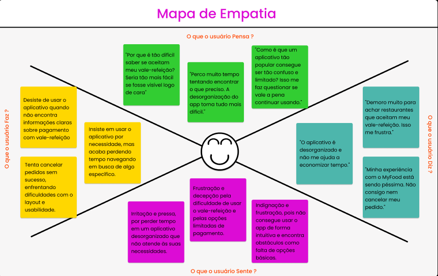

# 🎯 Inovando e Prototipando Soluções com Design Thinking no Figma

## O que é o Design Thinking?
Design thinking é uma metodologia de resolução de problemas que usa técnicas criativas e colaborativas para desenvolver produtos e serviços. O objetivo é criar soluções inovadoras que atendam às necessidades dos usuários. 

## 📌 Visão geral e desafio 
> Imagine-se contratado por uma startup que enfrenta desafios de usabilidade em seu aplicativo, seja ele de e-commerce ou de entregas. Seu desafio é aplicar o Design Thinking para compreender as necessidades dos usuários, definir claramente o problema, gerar ideias, criar um protótipo no Figma e apresentar a solução final em um vídeo pitch de até 5 minutos.

## Etapas do Design Thinking aplicadas ao projeto
### **Empatia:** Coleta de dados para entender as necessidades do usuário. 
   - **Usuário:** Amanda, 19 anos, estudante de medicina e usuária frequente de
aplicativos de delivery
     - "Eu gosto do app, mas demoro muito para achar restaurantes que
        aceitam meu vale-refeição. Fico entrando em várias lojas para conferir e,
        às vezes, desisto de comprar por causa disso. Sem contar que as opções
        de pagamento são muito limitadas, não tem a opção de pagar por pix,
        carteira digital ou na entrega. Isso acaba sendo frustrante e
        decepcionante.”

   - **Usuário:** Lucas, 23 anos, é estagiário de dados no Itaú e estudante de Data
Science 
     - “Com a correria do meu dia a dia, sempre escolho pedir comida por
        delivery, mas o MyFood tem me decepcionado bastante. O aplicativo é
        muito desorganizado, com todas as lojas misturadas, e não tem como
        separar por categorias. Isso dificulta muito encontrar o que preciso e
        acaba me fazendo perder tempo.”

   - **Usuário:** Marina, 26 anos, professora e CEO da MyMusic - escola de música
     - “Minha experiência com o MyFood está sendo péssima. Não consigo
        cancelar meu pedido porque simplesmente a opção de cancelamento
        sumiu. Além disso, o layout é super confuso, tem muito texto espalhado
        e os ícones são tão pequenos que mal dá pra ver.” 

Obs.: Após o levantamento das informações, utilizei o mapa da empatia para organizar
os dados e facilitar a análise, preparando o caminho para a definição dos problemas na
próxima etapa. 

## Mapa da Empatia

### **Definição:** Análise dos dados para definir os problemas a serem resolvidos. 
   - Dificuldade em encontrar restaurantes com filtros adequados. 
     - **Insight:** Amanda demora muito para achar restaurantes que aceitam vale-refeição.
     - **Problema:** O app não oferece filtros eficientes, como por aceitação de benefícios.
     - **Impacto:** Perda de tempo e desistência de compras. 

   - Interface desorganizada e confusa.  
     - **Insight:** 
        - Lucas acha o aplicativo desorganizado, com lojas misturadas e
        sem categorias claras.
        - Marina destaca um layout confuso, com excesso de texto e
        ícones pequenos.
     - **Problema:** Falta de usabilidade na interface, dificultando a navegação e a busca por produtos.
     - **Impacto:** Frustração e desperdício de tempo 

   - Ausência de funcionalidades essenciais. 
     - **Insight:** 
        - Amanda sente falta de opções de pagamento como Pix, carteira digital e pagamento na entrega.
        - Marina não consegue cancelar pedidos devido à falta de visibilidade da funcionalidade.
     - **Problema:** O app carece de recursos básicos que facilitariam o uso no dia a dia.
     - **Impacto:** Decepção e insatisfação com o serviço.

**Frase-problema:** Os usuários do MyFood enfrentam dificuldades para encontrar
restaurantes compatíveis com suas preferências, navegam em uma interface confusa e
desorganizada, e não têm acesso a funcionalidades essenciais, como filtros adequados,
opções de pagamento flexíveis e suporte eficiente para cancelar pedidos. 